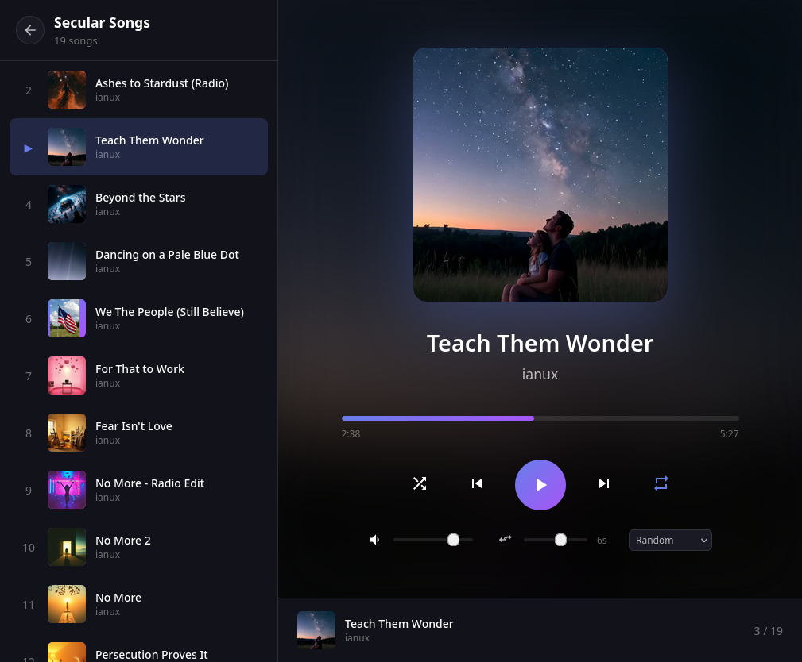

# Suno Playlist Player

A beautiful web-based playlist player for [Suno AI](https://suno.com) music with smooth crossfade transitions, visual effects, and a Spotify-like interface.


## Features

- **Supports Artists** - Play counts are reported to Suno so artists get credit for plays
- **Playlist Loading** - Just paste a Suno playlist URL and play
- **Real-time Artist Names** - Artist names load in the background via Puppeteer and update the UI as they're found
- **Beautiful UI** - Dark theme with blurred album art backgrounds
- **Smooth Fade-In** - Songs fade in gently to avoid jarring loud starts
- **Crossfade Transitions** - Smooth audio crossfading (0-10 seconds, defaults to 10s)
- **Smart Shuffle** - Plays through all songs before repeating any
- **Visual Transitions** - 5 transition styles + random mode:
  - Dissolve
  - Slide
  - Zoom + Blur
  - Flip
  - Morph
- **Playback Controls** - Play, pause, next, previous, shuffle, repeat
- **Volume Control** - Adjustable volume with keyboard shortcuts
- **Recent Playlists** - Quick access to previously played playlists
- **Auto-Loop** - Continuous playback by default
- **Keyboard Shortcuts**:
  - `Space` - Play/Pause
  - `N` - Next track
  - `P` - Previous track
  - `←/→` - Seek 10 seconds
  - `↑/↓` - Volume up/down

## Screenshots



*Player interface with crossfade controls and blurred background*

## Quick Start

### Prerequisites

- Node.js 18 or higher
- npm

### Installation

```bash
# Clone the repository
git clone https://github.com/imcmurray/SunoPlaylistPlayer.git
cd SunoPlaylistPlayer

# Install dependencies
npm install

# Start the server
npm start
```

### Usage

1. Open http://localhost:3000 in your browser
2. Paste a Suno playlist URL (try this example: `https://suno.com/playlist/06077ddd-a0e5-49ca-9445-b0049e9b0513`)
3. Click "Load Playlist" and enjoy!

## How It Works

The server uses [Puppeteer](https://pptr.dev/) to fetch playlist data from Suno:

1. When you submit a playlist URL, the server launches a headless browser
2. It navigates to the Suno playlist page and extracts song UUIDs
3. Song metadata (titles, covers) is fetched quickly via HTTP
4. The player starts immediately while artist names load in the background
5. Real artist names are fetched via Puppeteer and streamed to the UI in real-time
6. The player streams audio directly from Suno's CDN

```
┌─────────────┐     ┌─────────────┐     ┌─────────────┐
│   Browser   │────▶│   Server    │────▶│  Suno.com   │
│  (Player)   │     │ (Puppeteer) │     │  (Scraper)  │
└─────────────┘     └─────────────┘     └─────────────┘
       │                                       │
       │         ┌─────────────┐              │
       └────────▶│  Suno CDN   │◀─────────────┘
                 │   (Audio)   │
                 └─────────────┘
```

## Deployment

### Docker (Recommended)

```bash
# Download and run (no clone needed)
curl -O https://raw.githubusercontent.com/imcmurray/SunoPlaylistPlayer/main/docker-compose.yml
docker compose up -d
```

Access at http://localhost:3000

See [DOCKER.md](DOCKER.md) for homelab setup, reverse proxy configs, and troubleshooting.

### Railway

See [DEPLOYMENT.md](DEPLOYMENT.md) for instructions on deploying to Railway with GitHub Actions.

[](https://railway.app/template)

## Project Structure

```
suno-playlist-player/
├── server.js           # Node.js server with Puppeteer
├── playlist.html       # Main player interface
├── package.json        # Dependencies and scripts
├── Dockerfile          # Docker build config
├── docker-compose.yml  # Docker Compose config
├── DOCKER.md           # Docker/homelab deployment guide
├── nixpacks.toml       # Railway build config
├── DEPLOYMENT.md       # Railway deployment guide
└── .github/
    └── workflows/
        └── deploy.yml  # GitHub Actions workflow
```

## Configuration

### Environment Variables

| Variable | Default | Description |
|----------|---------|-------------|
| `PORT` | `3000` | Server port |
| `PUPPETEER_EXECUTABLE_PATH` | (auto) | Path to Chromium binary |

## API Endpoints

| Endpoint | Method | Description |
|----------|--------|-------------|
| `/` | GET | Redirects to playlist player |
| `/playlist.html` | GET | Main player interface |
| `/api/fetch-playlist?url=` | GET | Fetch playlist songs |
| `/api/fetch-songs-batch` | POST | Batch fetch song metadata |
| `/api/fetch-song-info?uuid=` | GET | Fetch single song info |
| `/api/fetch-artists-stream?uuids=` | GET | Stream artist names via SSE (Puppeteer) |

## Tech Stack

- **Backend**: Node.js, Puppeteer
- **Frontend**: Vanilla HTML/CSS/JavaScript
- **Audio**: HTML5 Web Audio API
- **Hosting**: Railway (recommended)

## Contributing

Contributions are welcome! Please feel free to submit a Pull Request.

## License

ISC License - see [LICENSE](LICENSE) for details.

## Disclaimer

This project is not affiliated with Suno AI. It's a fan-made player that uses publicly available data. Please respect Suno's terms of service.

---

Made with ♫ for the Suno community
